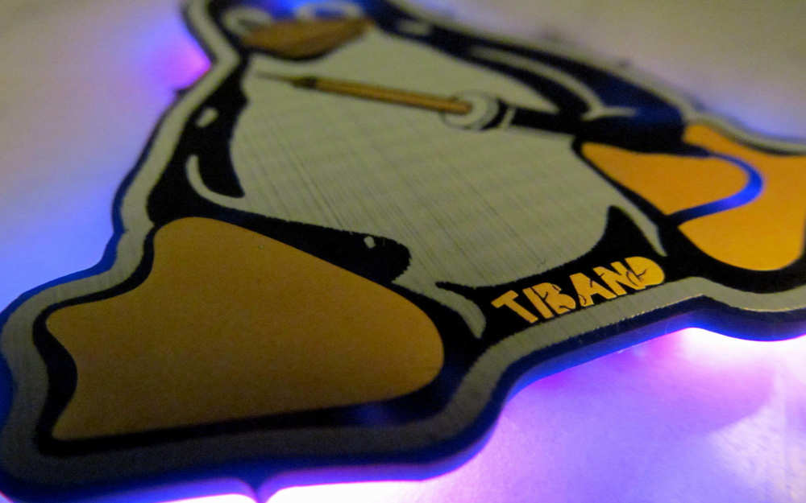

# TiTux badge

## board

The board is designed in KiCad and uses a dual sided pcb while only using one side for the components. It features an ATtiny84 with 6 LEDs and a switch powered by a 3 V button cell. The example above was manufactured by [OSH Park].

## code

The challenge is to come up with your own interesting light shows, games, etc. for the badge. This repo includes a basic Arduino sketch using the [ATTinyCore] to get you started.

Use some crocodile clips and an AVR ISP programmer like a standard Arduino UNO with the [ISP sketch] and a 10 μF capacitor.

## licence

The design and example firmware are licenced under `GPL-3.0-or-later`.

[OSH Park]: https://oshpark.com/
[ATTinyCore]: https://github.com/SpenceKonde/ATTinyCore
[ISP sketch]: https://www.arduino.cc/en/tutorial/arduinoISP